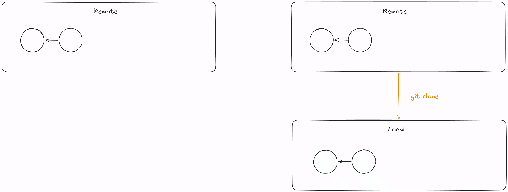
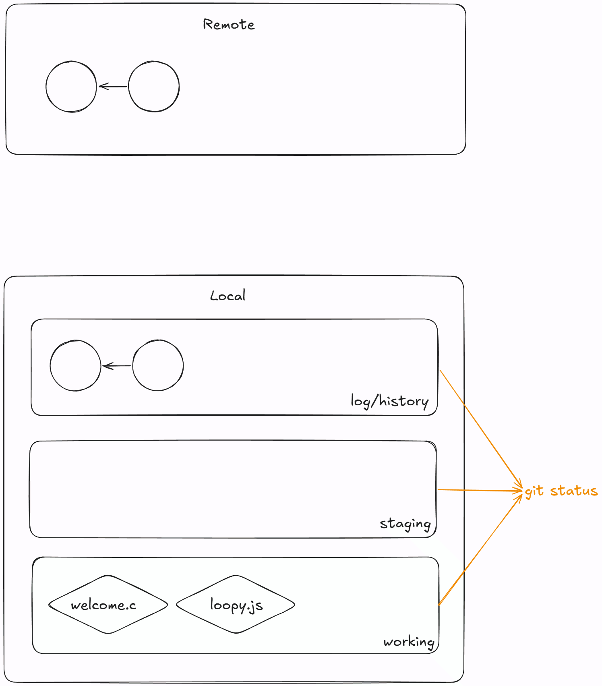
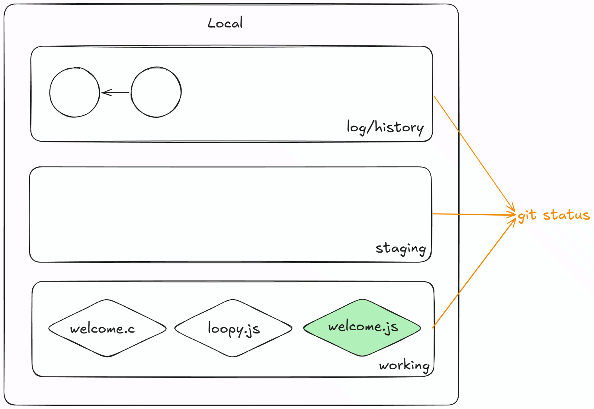
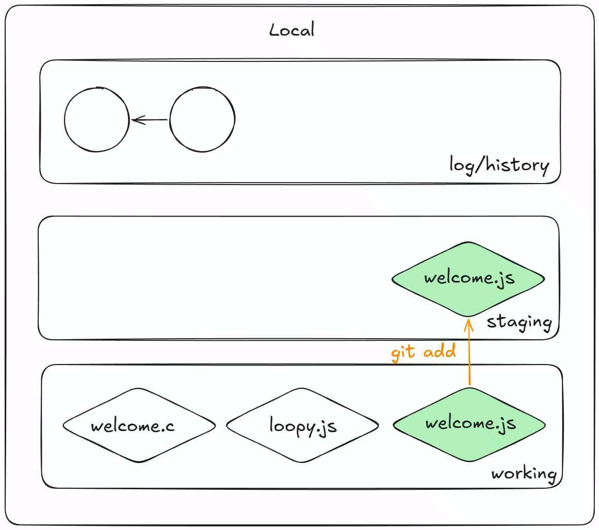
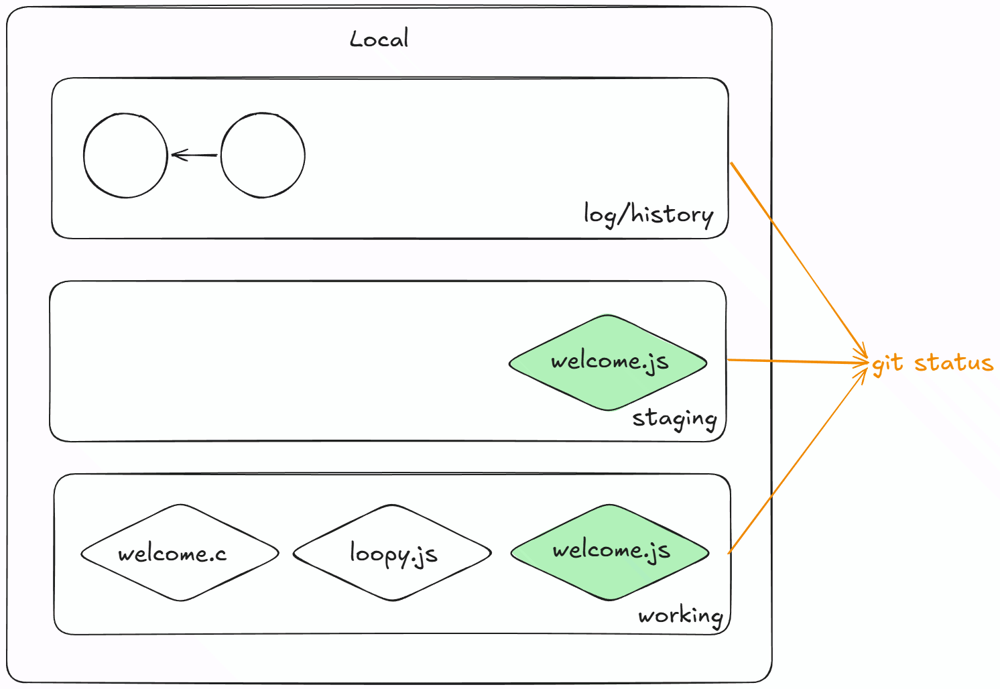
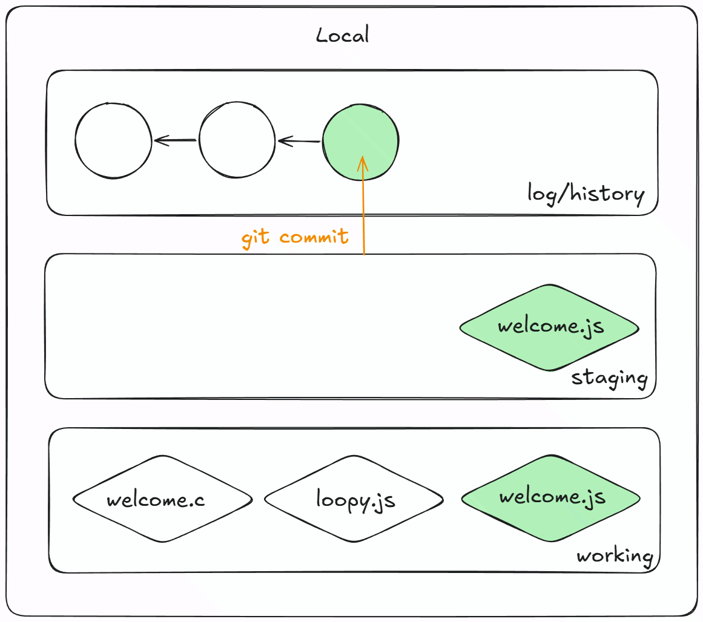
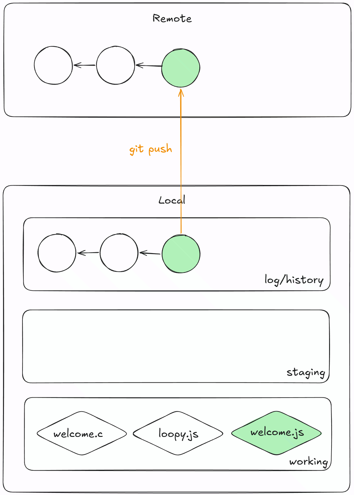
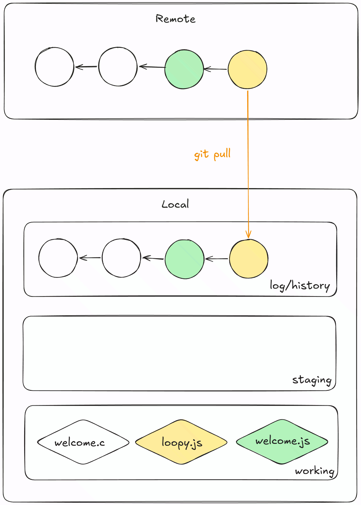

# Tutorial 1

[TOC]

## A. Javascript

### 1. Basic Syntax, Input/Output, Conditionals & Control Flow + Functions

Consider the C program in the file [welcome.c](welcome.c). In this repository, there is another file called [welcome.js](welcome.js). In this file, convert the C program above into a JavaScript program.

As you write the program, discuss the following questions:
- Why don't we need to specify the type of a variable when we declare it?

- What are `const` and `let`?

- How is JavaScript's `console.log` function different to `printf` in C?

- How can we format strings?

- What does `2 == '2'` return? why?

- Why don't JavaScript programs need a `main` function?

- How do we create a function? how is this different to creating functions in c?

### 2. Arrays, Objects, and Loops
Javascript objects are just a collection of properties, kinda like structs, but better. Properties are key value pairs in the form `key: value` where keys are strings and values can be of any type (String, Number, Array, Object, etc..).

```js
let fruit = {
    name: 'apple',
    cost: 2
}
```

1. How can we get the name and cost of the fruit in the object above?

2. Brainstorm ways we can loop through the shopping list given in [loopy.js](loopy.js) to print the names of all items in the shopping list?

3. Why should we use for of loops instead of for in loops where possible? <br> (`typeof` is a function that returns a string with the type of the argument passed in. what does this program output?)

    ```js
    const arr = [1, 2, 3]
    for (const i in arr) {
        console.log(typeof(i))
    }
    ```

4. [ADVANCED] We often need to perform common operations when working with arrays... JS has inbuilt array methods that can help us! Pick 1 or 2 loops in [methods.js](methods.js) to rewrite with array methods.

    You may find the following webpage useful: https://developer.mozilla.org/en-US/docs/Web/JavaScript/Reference/Global_Objects/Array

## B. Git Fundamentals

For many of you, this tutorial happens before you've seen the `git` content in lectures! This is by design, as the basics of git are quite straightforward and procedural. We will go into more depth in the future.

However, for right now, it's only important to know that `git` is a command line tool that helps you "save" your work on the cloud and makes it easier to collaborate with others. Right now we're going to focus on getting and saving our work with git.

1. To get the files from the remote repo (cloud) to your computer, run
    ```
    $ git clone [ssh link here]
    ```
    <details close>
    <summary> Diagram</summary>

    
    </details>
2. To check the status of your local repo, run
    ```
    $ git status
    ```
    <details close>
    <summary> Diagram</summary>

    
    </details>
3. Add your welcome.js code into the repo and run
    ```
    $ git status
    ```
    <details close>
    <summary> Diagram</summary>

    
    </details>
4. Add the file to the staging area
    ```
    $ git add welcome.js
    ```

    <details close>
    <summary> Diagram</summary>

    
    </details>
5. Run
    ```
    $ git status
    ```
    <details close>
    <summary> Diagram</summary>

    
    </details>
6. Commit files! remember to add a commit message
    ```
    $ git commit -m "finished welcome.js"
    ```
    <details close>
    <summary> Diagram</summary>

    
    </details>
7. Run
    ```
    $ git status
    ```
8. Push!
    ```
    $ git push
    ```
    <details close>
    <summary> Diagram</summary>

    
    </details>

Sometimes your remote repo may have some changes that aren't in your local repo (we may update lab activities). So how do we get changes from your remote repo into your local repo?

<details close>
<summary> Diagram</summary>


</details>

## Further Resources

- In addition to labs, there are smaller-scale "Practice Activities" that can be accessed on the Course Website and Gitlab. These are not worth any marks as the solutions have already been provided, although they can serve as a nice warmup for the labs.
- If you find yourself struggling to keep up with the course content, there are also NodeJS online courses available to help you build up your fundamentals, such as:
    - https://liveclasses.nodejsacademy.com/store/NodeJS-Introductory-Course-5boa5ezar0v9
    - https://www.codecademy.com/courses/learn-node-js/articles/welcome-to-learn-node-js
    - https://git-scm.com/book/en/v2/Getting-Started-What-is-Git%3F
