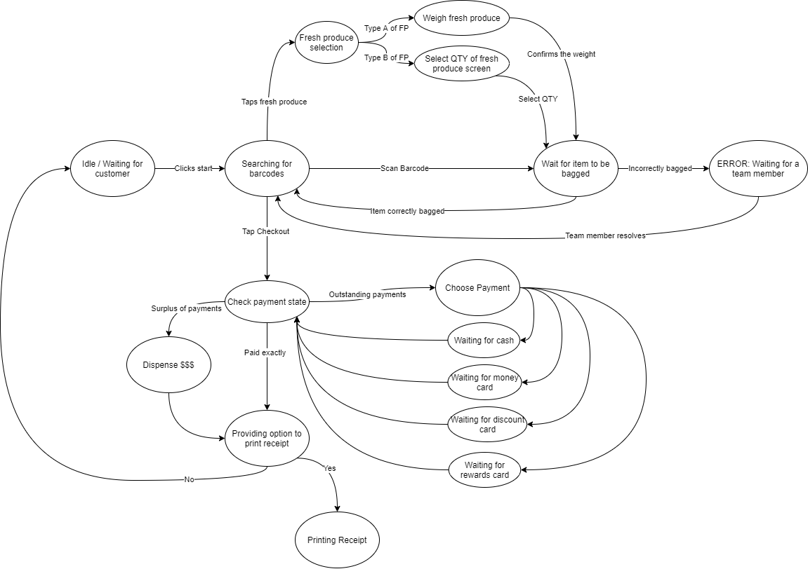
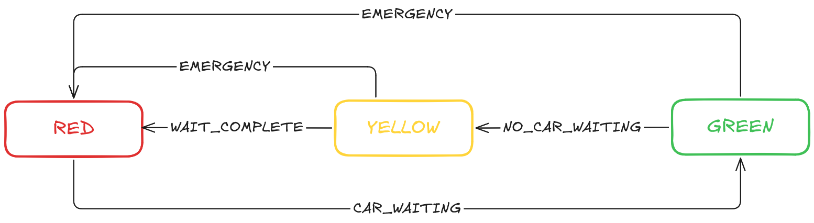

# Tutorial 8

[TOC]

## A. State Diagram

> 20 minutes

> Use the state diagram for the grocery store checkout system as an example, to explain how state diagrams work (states are in circles, actions are arrows between the circles), then move onto the activity

State diagrams are a type of behavioural model, that represent the state transitions of an object in response to actions or events.

Below is a state diagram of a grocery store checkout system (from the perspective of the user-machine interaction). Where;
- the circles represent `states` that the system is in
- the arrows between the circles represent `actions` that the user does to transition the system from one state to another

<details close>
<summary>click to view</summary>


</details>

As a class, discuss why state diagrams are useful and give an example.

> This could include:
> - Visualise lifecycle of an object,
> - Clarify system logic,
> - Simplify complex workflow, and
> - Provide shared visual reference for communication.
>
> Examples;
> - UI or Event-Driven Applications; login state, form validation, navigation processes
> - Embedded Systems; traffic controllers, vending machines,

### Task
In groups, create a state diagram that describes the states and transitions that might occur in a game of 'hide and seek tag', from the perspective of the seeker.

The simplified rules to hide and seek tag are:
- Game starts with one seeker, and all other players hiding
- When the seeker spots somebody, they must tag them
- Players who get tagged join the game as an additional seeker

Consider how you could turn this into a state diagram, from seekers perspective. Some possible states and actions you could consider are:
- `States` (of the seeker): searching, suspicious, chasing
- `Actions` (of the player): player is visible, player runs away, player is hidden

Spend 10-15 minutes in groups designing the state diagram for this game. You are not limited to the above states and actions (so be creative!). You should aim to make the game as balanced as possible between the seekers and the players.

> <details close>
> <summary>click to view</summary>
>
> One possible solution may be:
>
> 
> </details>


## B. Traffic Lights

> 15 minutes

Now that we've looked at how to illustrate a state machine, we'll look at how to turn one into code!

Below is a state diagram that represents a simple traffic light system. This system has three states (RED, YELLOW, GREEN), and three actions (CAR_WAITING, NO_CAR_WAITING, EMERGENCY) that are used to move between the states.



This state diagram is to be implemented in [traffic.ts](b.traffic/traffic.ts), using the function `updateLight` to transition between states. Each time the state is changed, it should print to terminal `"Light has changed to 'STATE'"`.

<table>
  <tr>
    <th>Name & Description</th>
    <th>Input Parameters</th>
    <th>Returned Object</th>
    <th>Errors</th>
  </tr>
  <tr>
    <td>
      <code>updateLight</code>
      <br/><br/>
      <ul>
      <li>Updates the state of the traffic light (following the state diagram).</li>
      <li>It should print each state change to the terminal (eg. 'Light has changed to "RED"') </li>
      </ul>
    </td>
    <td>
        (action)
    </td>
    <td>
        <code>{}</code>
    </td>
    <td>
        Throw <code>{error}</code> when:
        <ul>
          <li>provided action is not valid for the current system state</li>
        </ul>
    </td>
  </tr>
</table>

### Task
In groups or as a class, use the state diagram to complete the function `updateLight` in [traffic.ts](b.traffic/traffic.ts).

> <details close>
>
> <summary>click to view</summary>
>
> ```ts
> export function updateLight(action: Actions) {
>   if (light.state === 'GREEN') {
>     if (action === 'EMERGENCY') {
>       light.state = 'RED';
>     } else if (action === 'NO_CAR_WAITING') {
>       light.state = 'YELLOW';
>     } else {
>       throw new Error(`Action '${action}' invalid for '${light.state}' light.`);
>     }
>
>   } else if (light.state === 'YELLOW') {
>     if (action === 'EMERGENCY' || action === 'WAIT_COMPLETE') {
>       light.state = 'RED';
>     } else {
>       throw new Error(`Action '${action}' invalid for '${light.state}' light.`);
>     }
>
>   } else {
>     if (action === 'CAR_WAITING') {
>       light.state = 'GREEN';
>     } else {
>       throw new Error(`Action '${action}' invalid for '${light.state}' light.`);
>     }
>   }
>
>   console.log(`Light changed to ${light.state}`);
>   return;
> }
> ```
>
> </details>

Once you think your function is correct, you can test it by running the main program.
  > To run the main program:
  > ```shell
  > $ npm run tsx ./src/main.ts
  > ```
  >
  >
  > You should expect the following terminal output:
  > ```
  > Cycle 1:
  > Light has changed to GREEN
  > Light has changed to YELLOW
  > Light has changed to RED
  >
  > Cycle 2:
  > Light has changed to GREEN
  > Light has changed to YELLOW
  > Light has changed to RED
  > ```

A test suite has also been provided, which can be used to check the correctness of your code.

## C. DRY & KISS

> 15 minutes
> For tutors if you have additional time...

The code in [c.drykiss](c.drykiss/drykiss.ts) is unnecessarily complicated, and there is a lot of repetition. Take some time to refactor this code focusing on DRY and KISS principles to create a concise and easily-understood code.

Your tutor will split you up into groups. In 10 minutes, refactor the code into the least number of lines as possible using DRY and KISS principles (the group with the lowest number of lines, while still maintaining easy to read code, will win!)
>
> <details close>
>
> <summary>click to view</summary>
>
> ```ts
> import promptSync from 'prompt-sync';
>
> const prod = (numbers: number[]) => numbers.reduce((p: number, n: number) => p * n, 1);
>
> function drykiss(myList: number[]) {
>   const min = Math.min(...myList);
>   const max = Math.max(...myList);
>   const prodHead = prod(myList.slice(0, -1));
>   const prodTail = prod(myList.slice(1));
>   return [min, max, prodHead, prodTail];
> }
>
> const prompt = promptSync();
>
> const lst = [];
>
> // NOTE: there may be a red squiggly line if we do not have "target": "es6"
> // (or later) under "compilerOptions" in our tsconfig.json.
> // This will not affect the program if it is run directly with tsx though!
> //
> // Another workaround would be using:
> //    'abcde'.split('')
> for (const letter of 'abcde') {
>   const num = parseInt(prompt(`Enter ${letter}: `));
>   lst.push(num);
> }
> /*
> // Alternative lst initialisation:
> const lst = ['a', 'b', 'c', 'd', 'e'].map(letter => parseInt(prompt(`Enter ${letter}: `)));
> */
>
> const [min, max, prodHead, prodTail] = drykiss(lst);
> const prodLength = lst.length - 1;
>
> console.log(`Minimum:\n${min}`);
> console.log(`Maximum:\n${max}`);
> console.log(`Product of first ${prodLength} numbers:\n${prodHead}`);
> console.log(`Product of last ${prodLength} numbers:\n${prodTail}`);
> ```
>
> </details>
